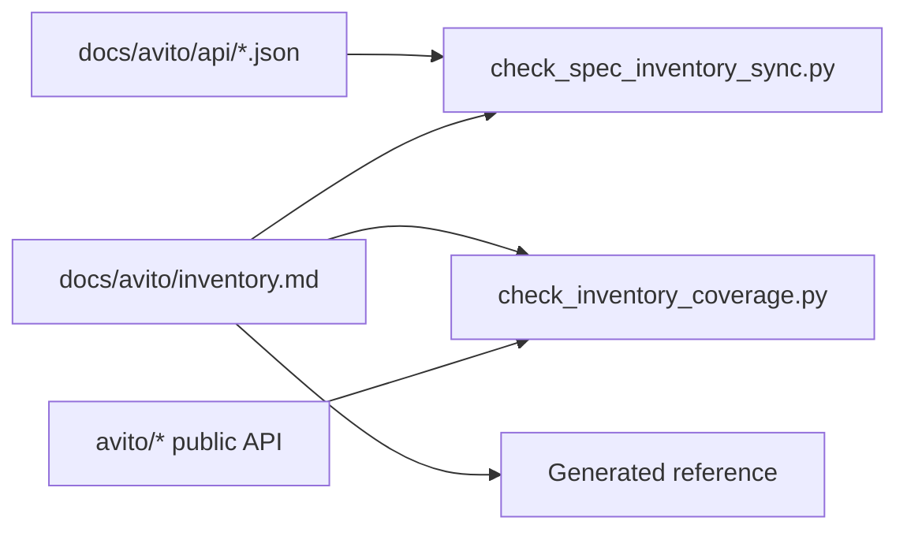

# Покрытие API и deprecation

Swagger/OpenAPI-файлы в `docs/avito/api/` считаются upstream source of truth. `docs/avito/inventory.md` связывает каждую HTTP-операцию с доменным объектом SDK, публичным методом, типами запроса/ответа и deprecation metadata.

## Почему нужны оба источника

OpenAPI описывает upstream API. Inventory описывает, где эта операция живёт в SDK. Если операция есть в spec, но отсутствует в inventory, пользователь не найдёт её в SDK. Если операция есть в inventory, но отсутствует в spec, inventory устарел или описывает неподтверждённый контракт.

## Deprecated metadata

Для deprecated-операций inventory хранит `deprecated_since`, `replacement` и `removal_version`. Эти поля нужны сразу в трёх местах: runtime `DeprecationWarning`, reference warning и changelog/release notes.

Deprecated-страница в reference не заменяет runtime warning. Если символ устарел, пользователь должен получить предупреждение при вызове, а не только при чтении сайта.

## Гейты

`check_spec_inventory_sync.py` сверяет operation-level coverage: документ, раздел, HTTP method и path. `check_inventory_coverage.py` сверяет связь inventory с публичной SDK-поверхностью и sanity deprecation-полей.

Страница для пользователя: [покрытие API](../reference/coverage.md). Карта операций: [operations reference](../reference/operations.md).
