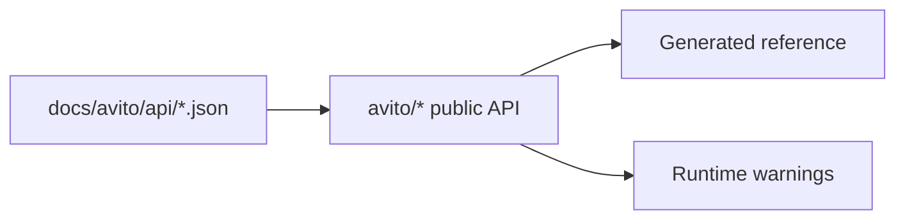

# Покрытие API и deprecation

Swagger/OpenAPI-файлы в `docs/avito/api/` считаются upstream source of truth. Справочник reference строится из публичной поверхности SDK и показывает доступные доменные объекты, методы, модели и deprecation metadata.

## Почему нужны оба источника

OpenAPI описывает upstream API. Reference описывает публичный SDK-контракт, с которым работает пользователь. Если операция есть в spec, но отсутствует в публичной поверхности SDK, пользователь не найдёт её в документации и не сможет вызвать через фасад.

## Deprecated metadata

Для deprecated-операций SDK хранит `deprecated_since`, `replacement` и `removal_version`. Эти поля нужны сразу в трёх местах: runtime `DeprecationWarning`, reference warning и changelog/release notes.

Deprecated-страница в reference не заменяет runtime warning. Если символ устарел, пользователь должен получить предупреждение при вызове, а не только при чтении сайта.

## Гейты

Публичная поверхность проверяется contract-тестами и сборкой reference-документации. Deprecated-символы должны сохранять runtime warning, а не только пометку в документации.

Страница для пользователя: [покрытие API](../reference/coverage.md). Карта операций: [operations reference](../reference/operations.md).
