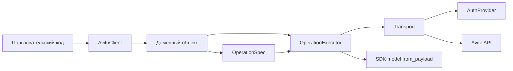

# Архитектура SDK

SDK построен вокруг одного публичного фасада `AvitoClient`. Он создаёт доменные
объекты, а доменные объекты исполняют явно описанные `OperationSpec` через общий
`OperationExecutor`. `Transport` отвечает за `httpx`, retry, token injection и
маппинг ошибок. Публичные dataclass-модели сами преобразуют JSON через
`from_payload()`, а request/query dataclass-и сериализуются через `to_payload()`
и `to_params()`.

Такое разделение удерживает публичный API простым: пользовательский код работает
с доменными объектами и typed-моделями, но не управляет заголовками, refresh
token-flow, retry-циклами или JSON-маппингом вручную.

## Границы слоёв

| Слой | Ответственность |
|---|---|
| `AvitoClient` | Единая точка входа, context manager, фабрики доменных объектов |
| Domain object | Публичные методы конкретного сценария, например `account().get_self()` |
| `OperationSpec` | HTTP method/path, retry mode, request/query model class и response model class |
| `OperationExecutor` | Path rendering, сериализация query/body, вызов transport и передача response payload в модель |
| `Transport` | `httpx.Client`, retry, timeouts, auth header, error mapping |
| `AuthProvider` | Получение, кэширование и инвалидирование токенов |
| Model | `from_payload()`, `to_payload()`, `to_params()`, enum-ы и публичная сериализация |

Публичные методы не возвращают raw `dict` и не принимают transport-layer request DTO. Если операция требует сложный payload, доменный метод раскрывает понятные keyword-only параметры или публичную модель, закреплённую в reference.
