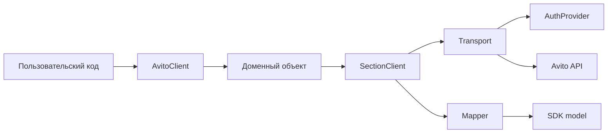

# Архитектура SDK

SDK построен вокруг одного публичного фасада `AvitoClient`. Он создаёт доменные объекты, а доменные объекты делегируют HTTP-операции section client-ам. Transport отвечает за `httpx`, retry, token injection и маппинг ошибок. Mappers преобразуют JSON в публичные dataclass-модели.

Такое разделение удерживает публичный API простым: пользовательский код работает с доменными объектами и typed-моделями, но не управляет заголовками, refresh token-flow, retry-циклами или JSON-маппингом вручную.

## Границы слоёв

| Слой | Ответственность |
|---|---|
| `AvitoClient` | Единая точка входа, context manager, фабрики доменных объектов |
| Domain object | Публичные методы конкретного сценария, например `account().get_self()` |
| Section client | HTTP path, method, payload и выбор mapper-а для одного API-раздела |
| `Transport` | `httpx.Client`, retry, timeouts, auth header, error mapping |
| `AuthProvider` | Получение, кэширование и инвалидирование токенов |
| Mapper | Преобразование JSON-ответа в публичную SDK-модель |

Публичные методы не возвращают raw `dict` и не принимают transport-layer request DTO. Если операция требует сложный payload, доменный метод раскрывает понятные keyword-only параметры или публичную модель, закреплённую в reference.
