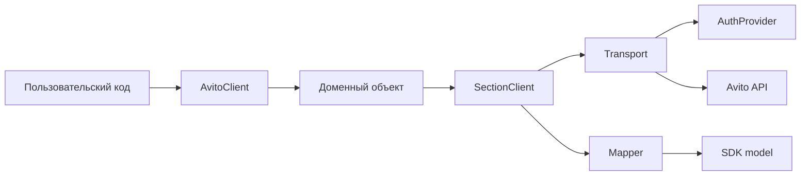

# Архитектура SDK

!!! note "Раздел в разработке"
    Полное объяснение архитектуры будет добавлено в PR 3.

    Сейчас страница содержит минимальную Mermaid-диаграмму, чтобы строгая сборка сайта проверяла поддержку диаграмм в MkDocs Material.

