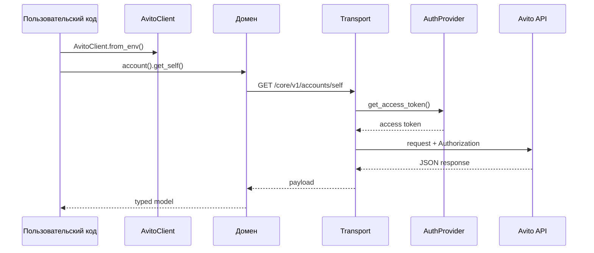

# OAuth и токены

SDK прячет OAuth-обмен за `AuthProvider`, чтобы пользовательский код работал с доменными методами, а не с access token, refresh token и заголовками `Authorization`.

## Где живёт ответственность

`AvitoClient` создаёт общий контекст: настройки, auth и transport. Доменный объект выбирает бизнес-операцию. Section client знает HTTP path и payload. `Transport` добавляет токен и применяет retry. `AuthProvider` кэширует токен и обновляет его, если upstream отвечает `401`.

Такой порядок важен для public contract: публичный метод не принимает access token, не возвращает OAuth-payload и не требует от пользователя повторять refresh-flow.

## Ошибка 401

`401` считается ошибкой аутентификации, а не авторизации. SDK инвалидирует токен там, где это допустимо, и поднимает `AuthenticationError`, если запрос не может быть выполнен успешно. `403` остаётся отдельным `AuthorizationError`: эти типы не наследуются друг от друга.

## Autoteka

Часть операций Автотеки использует отдельные OAuth-настройки. Они лежат в `AuthSettings` рядом с основными credentials, но не смешиваются с публичными методами домена: пользователь вызывает `autoteka_vehicle()` и `autoteka_report()`, а выбор token endpoint остаётся внутренним поведением auth-слоя.

Список env-переменных смотрите в [reference по конфигурации](../reference/config.md).
