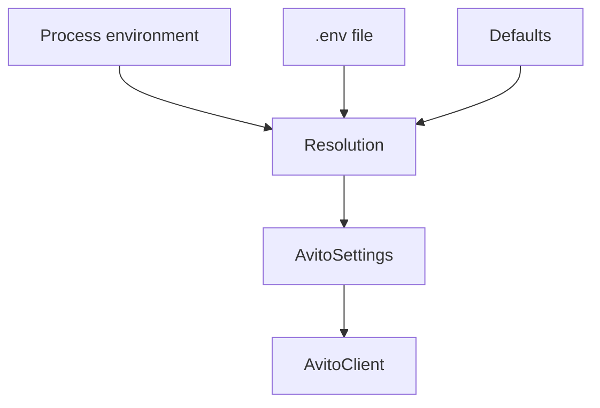

# Resolution конфигурации

Конфигурация должна быть детерминированной: один и тот же набор env-переменных и `.env` даёт один и тот же `AvitoSettings`. Это важно для CLI, CI и долгоживущих фоновых задач.

## Приоритет

Значения из process environment имеют приоритет над `.env`. `.env` имеет приоритет над значениями по умолчанию. Если `env_file` передан явно, SDK читает именно этот файл. Если обязательные OAuth credentials отсутствуют, клиент поднимает `ConfigurationError` при создании, до первого HTTP-запроса.

## Alias-переменные

Для OAuth доступны короткие alias-переменные вроде `AVITO_CLIENT_ID` и вложенные имена вроде `AVITO_AUTH__CLIENT_ID`. Alias нужен для удобства, вложенное имя — для явного соответствия `AuthSettings`.

## Иммутабельность клиента

После создания `AvitoClient` настройки не меняются. Если нужен другой `base_url`, `user_id`, auth или retry policy, создаётся новый клиент. Это убирает класс ошибок, где часть доменных объектов работает со старой конфигурацией, а часть — с новой.

Полная таблица env-переменных и per-operation overrides находится в [reference по конфигурации](../reference/config.md).
