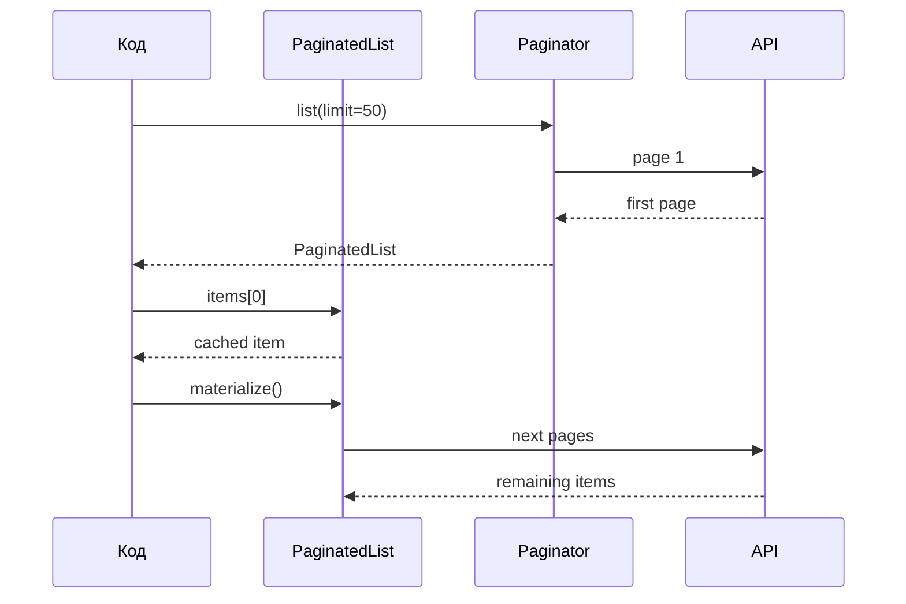

# Семантика пагинации

`PaginatedList[T]` делает list-операции ленивыми: первая страница загружается сразу, а последующие страницы читаются только при обращении к данным за пределами уже загруженного диапазона.

## Почему не обычный `list`

Обычный `list[T]` заставил бы SDK либо загружать все страницы сразу, либо скрывать сетевые запросы внутри уже материализованного типа. `PaginatedList[T]` явно показывает, что чтение коллекции может вызвать дополнительные запросы.

## Гарантии

Первая страница загружается при создании результата. Повторный доступ к уже загруженным элементам не делает новый HTTP-запрос. `materialize()` дочитывает все страницы ровно один раз. Ошибка на следующей странице поднимается в момент обращения к этой странице, а не при создании первой.

## Что документировать в public API

Если метод возвращает `PaginatedList[T]` runtime, его аннотация тоже должна быть `PaginatedList[T]`. Аннотация `list[T]` для ленивого результата считается нарушением контракта: пользователь не увидит, где возможны сетевые запросы.

Практический пример есть в [how-to по объявлениям](../how-to/ad-listing-and-stats.md), полный контракт — в [reference по пагинации](../reference/pagination.md).
