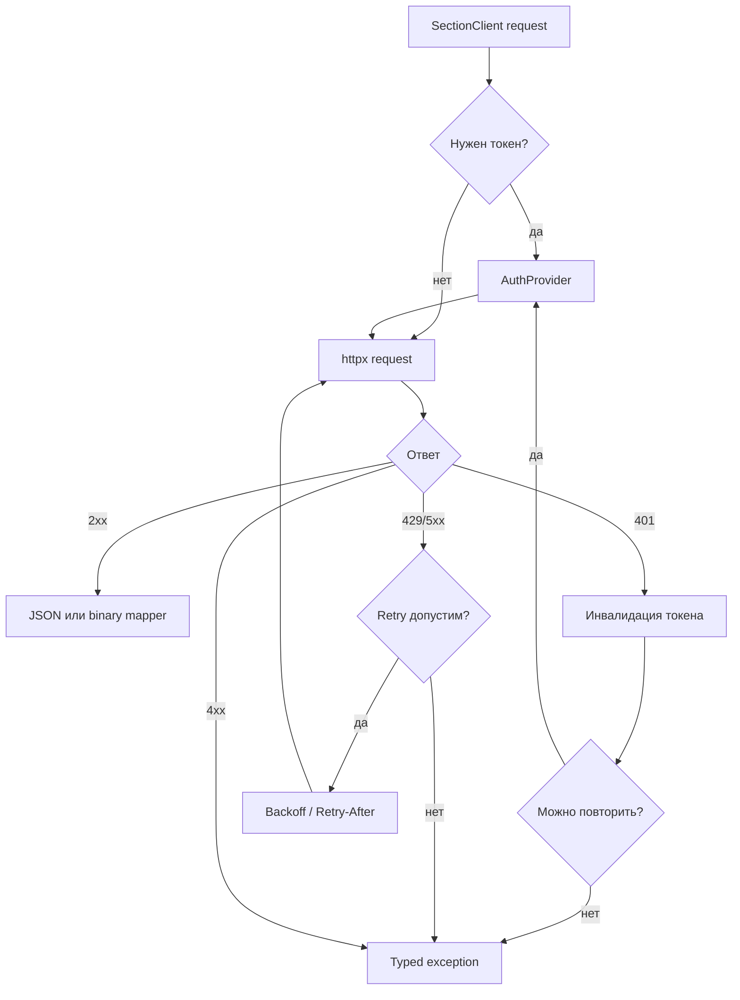

# Transport и retry

`Transport` — единственный слой, который работает с `httpx`, таймаутами, retry и mapping HTTP-ошибок. Домены и section clients не повторяют эту логику, иначе публичное поведение разных разделов начало бы расходиться.

## Что повторяется

Retry применяется только там, где операция помечена как безопасная для повтора. Read/list/probe операции обычно допускают retry. Write-операции получают retry только при явной идемпотентности, например через `idempotency_key`, или когда конкретный section client помечает операцию как безопасную.

`429` учитывает `Retry-After`, если upstream его вернул. Для `5xx` используется retry-политика transport-слоя. Ошибки маппинга не повторяются: если JSON уже получен, но не соответствует контракту модели, это `ResponseMappingError`, а не сетевой сбой.

## Почему retry не в доменах

Доменный объект должен описывать публичный сценарий: `order_label().create()` или `ad_stats().get_item_stats()`. Если retry появится на этом уровне, одинаковые HTTP-коды начнут вести себя по-разному в разных пакетах. Поэтому retry централизован и проверяется через transport/fake transport.

Подробные исключения смотрите в [модели ошибок](error-model.md) и [reference по исключениям](../reference/exceptions.md).
